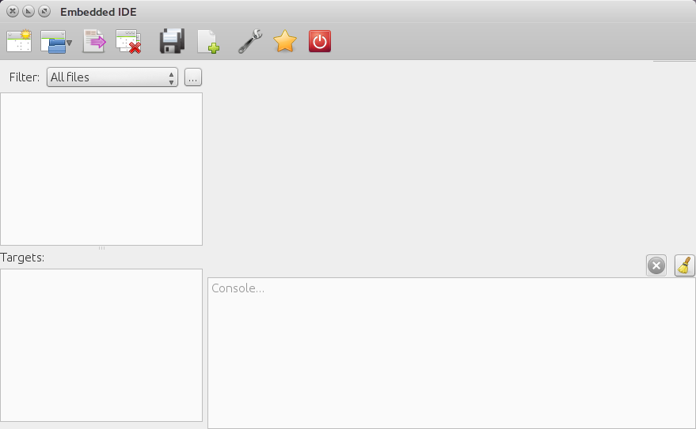
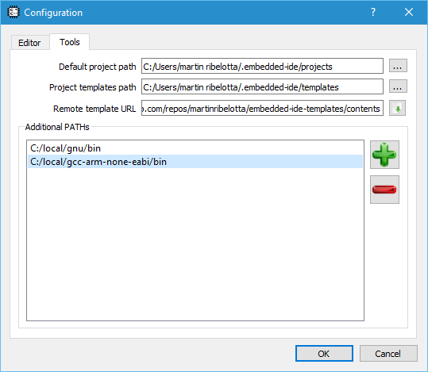
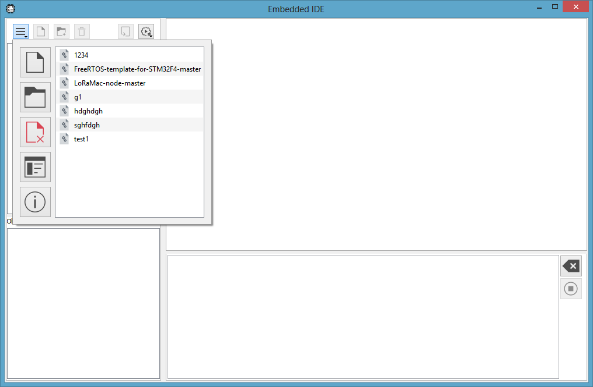
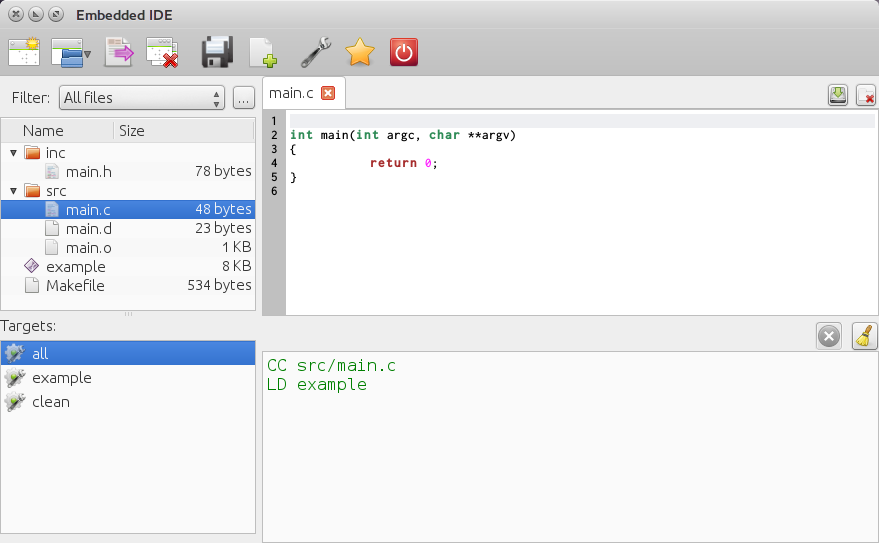
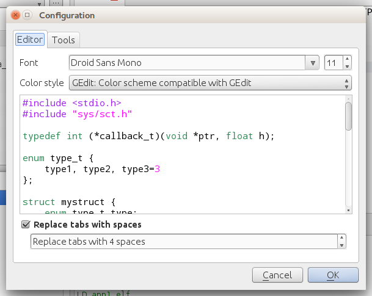
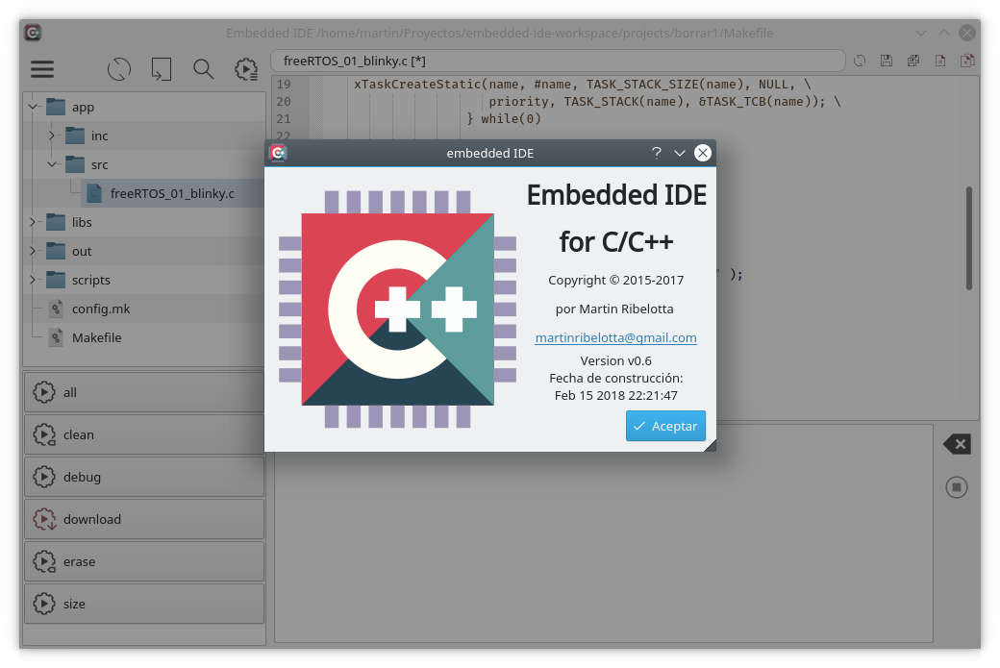

# Embedded IDE

Makefile based, C/C++ IDE



## Features
  - Syntax highlighter (C/C++/Makefile)
  - Autocomplete (requires clang installed on path)
  - Target autodiscover
  - Source filter
  - Project import/export
  - Console log

## Requirements

  - GNU Make (required)
  - Qt5
  - QScintilla2
  - clang (optional for autocompletion)
  - diff and patch (optional for import/export project)
  - universal-ctags (optional for code indexing)

## Installation

To compile and install IDE you need Qt5 (5.2 or later) and make/gcc (build-essential en Ubuntu and derived)

In base directory run:
```bash
qmake && make
```

When the process is finished, the executable is in `build` directory with the name `embedded-ide` (with EXE extention on windows)

To install it into the system copy `build/embedded-ide` to directory into the PATH

### Install dependencies

The full toolset installation (for ubuntu and derivatives) is:

```bash
sudo apt-get install clang diffutils patch ctags make
```

Additionally you need a compiler to work correctly. All gcc based compilers are supported, such as:

  - System gcc/g++ with `sudo apt-get install build-essential`
  - [ARM Embedded](https://launchpad.net/gcc-arm-embedded)
  - [RISC-V GNU toolchan](https://riscv.org/software-tools/)
  - [MIPS32/PIC32 gcc](https://github.com/chipKIT32/chipKIT-compiler-builds/releases)
  - All gcc based toolchain [from CodeSourcery](https://www.mentor.com/embedded-software/sourcery-tools/sourcery-codebench/editions/lite-edition/)
  - All [linaro toolchains](http://www.linaro.org/downloads/)
  - And much others...
  - [Cygwin toolchains](https://www.cygwin.com/)
  - [MinGW/MSYS enviroment](http://www.mingw.org/)

### Adding tools to the PATH

In order to find utilities, you need to add them to the PATH, but doing it globally is dangerous in certain cases (Example, windows with multiple toolchains with similar names)

Alternatively, the IDE provides an **Additional PATHs** feature to configure the PATH only for IDE and not for the entire system.

Go to **Configure** icon and next go to **Tools** tab.



Into **Additional PATHs** section you can add multiple directories. The list is append to system PATH at runtime in top-to-bottom order.

## Screenshots





